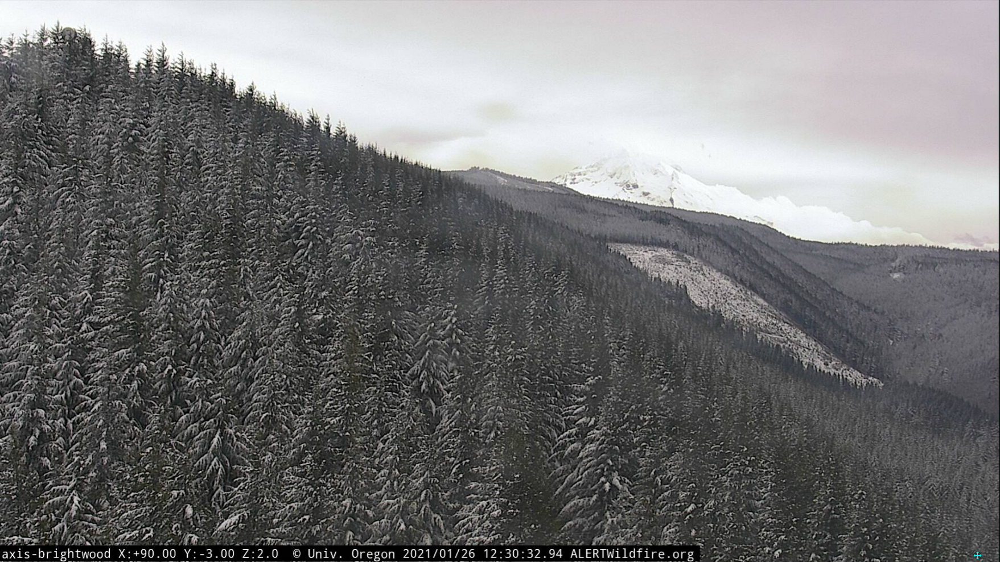
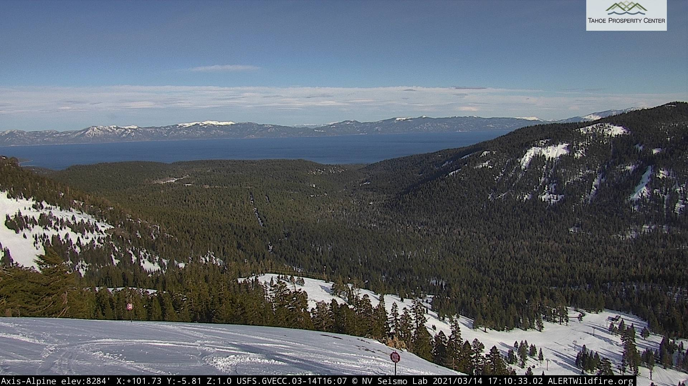

Data wrangling
=================

As with the rest of this project, this document is very much a work in progress (not even a draft yet).

## Extract

Data collection currently comes from three sources: live metadata from all lookout cameras, [live imagery](http://www.alertwildfire.org/) from a subset of active lookout sites, and hourly weather data from [openweathermap.org](https://openweathermap.org).

### Images and station metadata

As of the time of this writing (03/16/2021) I have approximately 75,000 images collected from 11 sites. As an example of a typical image, this frame was captured on the `Axis-Brightwood` station near Mt. Hood, OR:



<!--  -->

Images and site metadata are obtained by periodically querying the public API endpoint that drives the live web streams on the [alertwildfire](http://www.alertwildfire.org/) website.
Those endpoints are actually just public S3 buckets that are updated regularly. I fetch data from all stations once every 15 minutes, although the actual data is available at a much higher sample rate if it turns out I need higher temporal resolution for whatever reason.

The only challenge with the imagery and metadata are that the S3 endpoint is configured to only allow access from the [alertwildfire.org](alertwildfire.org) domain.
That's trivial to handle by just sending a "`Referer: https://www.alertwildfire.org`" header along with each request.

Data retrieval fees become a real consideration if I need to access any of my archived imagery data, so during the data transformation step I create a resized version of each image, saved alongside the full resolution images.
I also extract all of the exif data from each image in case I need to query other metadata without accessing the full image content.

Station metadata comes from the same S3 bucket, and is fetched in batch for all cameras during the same loop that retrieves images.
It is lightly cleaned up to dump some redundant or irrelevant fields, and then dumped into .csv files for subsequent processing.

All images and metadata are then uploaded into a dedicated S3 bucket.
The whole process is contained in the [scraper.py](./scraper.py) script, which is executed with a basic CLI syntax:

```
>> ./scraper.py -h

usage: scraper.py [-h] -s STATION [--delay DELAY] [--limit LIMIT] [--tmpdir TMPDIR]
                  [--quiet] destination

positional arguments:
  destination           Base path of destination. Files will be saved relative to this
                        directory in subfolders named after each station.
                        This value may point to an S3 endpoint with an 's3://' URI.
                        Local directories will be created if they do not exist.

optional arguments:
  -h, --help            show this help message and exit
  -s STATION, --station STATION
                        Name of a camera station, e.g. Axis-Brightwood. Multiple station
                        names may be specified, but at least one is required.
                        All stations can be requested as "all".
  --delay DELAY         Seconds between attempts to poll for new imagery.
  --limit LIMIT         Maximum number of polling attempts.
  --tmpdir TMPDIR       Local directory in which to store downloaded images before
                        transferring them to the destination.
  --quiet               Suppress (most) output
 
Examples:
  ./scraper.py -s Axis-Alpine -s Axis-Brightwood --delay 30 /home/user/AlertWF
  
  ./scraper.py -s all --delay 900 --quiet s3://my-bucket/AlertWildfire
```

### Weather data

It's possible to get data for the past 5 days with an unpaid [openweathermap.org](openweathermap.org) account, but getting data any further back costs money. I had been collecting data from the Axis-Brightwood site in Oregon for about a month before I decided to also log weather data, so I'm considering purchasing access to historical data for that one site.

Weather data is retrieved by the [getweather.py](./getweather.py) script, which is run once per day as a `cron` process.

## Transform

[Work in progress]

<!--

```python
import numpy as np
from skimage import data
from skimage.io import imread, imsave
from skimage.util import img_as_ubyte
from skimage.filters.rank import entropy
from skimage.morphology import disk
from skimage.color import rgb2hsv, rgb2gray, rgb2yuv

img = imread('fname.jpg')
img_gray = rgb2gray(img)
img_entropy = entropy(img_gray, disk(5))
imsave('fname-entropy.jpg', img_entropy)
```
-->

## Load

Data is divided into three SQL tables, arranged as follows:

<table style='display:block; width: 100%'>
    <tr><th>Table</th><th>Columns</th></tr>
    <tr><td>stations</td><td>name, lon, lat, elevation</td></tr>
    <tr><td>weather</td><td>station, time_stamp, temperature, wind, precip, ...</td></tr>
    <tr><td>images</td><td>
        station, time_stamp, path, resolution, azimuth, tilt, zoom, night_mode,<br/>
        feature_{min, max, mean, median, grad_x_entropy, grad_y_entropy}
    </td></tr>
</table>

The complete schema is defined in [CreateDBTables.sql](CreateDBTables.sql).

The stations table was populated once from the metadata described above.

Imagery data is initially fetched with minimal processing applied, and information about new images is loaded to the database in batches, once per day.
Loading imagery to the `images` table is handled by [load2db.py](./load2db.py), and is run once a day.

## ETL Pipeline

This whole process is orchestrated by the cron scheduler on my desktop using the following configuration:

```cron
# m     h   dom mon dow command
0      */6  *   *   *   /path/to/scraper.py -s all --limit 1 --quiet s3://my-bucket/AlertWildfire
0       2   *   *   *   /path/to/load2db.py
0       3   *   *   *   /path/to/getweather.py
```